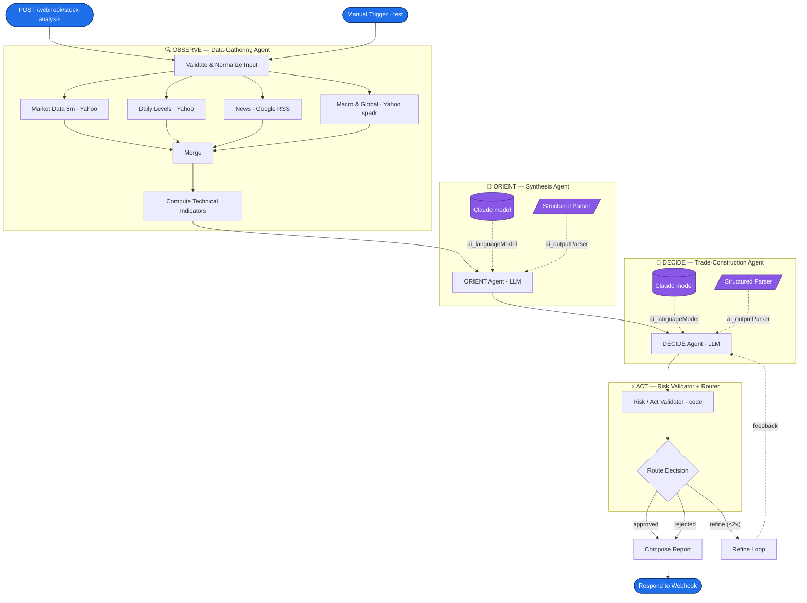

# OODA-INTRADAY — Multi-Agent AI Stock Analysis Workflow (n8n)

A complete, **importable n8n workflow** that turns a single stock symbol into a
structured, risk-checked intraday trade report. It is built as a **multi-agent
system** that mirrors the **OODA loop** (Observe → Orient → Decide → Act) of a
senior proprietary-desk trader.

> ⚠️ **Educational analysis only. Not investment advice. Verify independently.**
> The agent is a decision-support / thinking partner — *not* a tipster or signal bot.
> Its prime directive is **capital preservation > opportunity**: when a setup is weak
> it returns `NO_TRADE`, not a forced call.

- **Import file:** [`workflow/OODA-Intraday-Stock-Analysis.json`](workflow/OODA-Intraday-Stock-Analysis.json)
- **Builder (single source of truth):** [`build_workflow.py`](build_workflow.py)
- **Agent prompt:** [`docs/SYSTEM_PROMPT.md`](docs/SYSTEM_PROMPT.md)
- **Samples:** [`examples/`](examples/)

---

## 1. What it does (one line per stage)

1. **Input** — accepts `{ symbol, capital, riskPercent }` via Webhook (or Manual Trigger for testing).
2. **Observe** — fan-out HTTP calls gather intraday candles, daily levels, news and macro proxies; a Code node computes the indicators.
3. **Orient** — an LLM synthesizes the data into a structured *Market Thesis*.
4. **Decide** — an LLM constructs a *Trade Plan* only if the multi-confirmation stack passes.
5. **Act** — a deterministic *Risk Validator* checks the plan and **routes**: approve, **refine (feedback loop)**, or reject.
6. **Report** — a structured JSON report is returned over the webhook.

---

## 2. System flowchart



The dashed arrow `Refine Loop ⤏ DECIDE Agent` is the **feedback loop**: when the
Risk Validator rejects a plan but retries remain, the validator's critique is fed
back into the DECIDE agent so it can repair the plan (or downgrade to `NO_TRADE`).

---

## 3. The agents — role · inputs · outputs · decision logic

| # | Agent (n8n nodes) | Role | Inputs | Outputs | Decision logic |
|---|---|---|---|---|---|
| 0 | **Input Gate** — `Validate & Normalize Input` (Code) | Guard / normalize | raw webhook body | `symbol`, `yahooSymbol`, `capital`, `riskPercent`, `maxAttempts` | Reject malformed tickers; map indices (`NIFTY→^NSEI`) & NSE cash (`→.NS`); **hard-cap risk at 2%** |
| 1 | **OBSERVE** — 4× `HTTP Request` → `Merge` → `Compute Technical Indicators` (Code) | Gather raw market data, compute indicators | normalized request | **Market Observation Brief**: price, PDH/PDL/PDC, opening range, VWAP, EMA20/50, RSI14, ATR14, volume vs 20-day avg, macro proxies, news headlines, `dataQuality` | All calls **fail-soft** (`onError: continueRegularOutput`); indicator code is fully defensive and records `warnings` instead of throwing |
| 2 | **ORIENT** — `ORIENT Agent` (LLM Chain) + Claude model + structured parser | Synthesize data into a thesis | Observation Brief | **Market Thesis** (regime, timeframe, bias, ranked S/R zones, liquidity pools, volume read, VWAP posture, sector, event risk) | LLM classifies regime & bias; structured parser enforces shape; temp `0.3` |
| 3 | **DECIDE** — `DECIDE Agent` (LLM Chain) + Claude model + structured parser | Construct the trade | Brief + Thesis + (optional) validator feedback | **Trade Plan** *or* `NO_TRADE` (entry zone, trigger, stop, T1/T2/T3, R:R, confirmations, invalidation, time stop) | Requires **3+ confirmations** & R:R ≥ 1:2; temp `0.1` (disciplined); honors feedback on refine |
| 4 | **ACT** — `Risk / Act Validator` (Code) + `Route Decision` (Switch) | Deterministic gatekeeper & router | Trade Plan, capital, risk%, `$runIndex` | `route` ∈ {approved, refine, rejected}, recomputed **position size / R:R / ₹-at-risk**, feedback string | See §4 |
| 5 | **REPORT** — `Compose Report` (Code) → `Respond to Webhook` | Assemble & return | validator output + Brief + Thesis | final structured JSON report | Branches on `route`: full plan vs `NO_TRADE` reasons |

Why split into agents instead of one mega-prompt? **Separation of concerns** →
each LLM call is smaller, cheaper and easier to constrain; the **risk gate is
deterministic code** (not the LLM marking its own homework); and the **feedback
loop** can target a specific phase without re-running data collection.

---

## 4. Routing, validation & the feedback loop

The **Risk / Act Validator** is the control center. It runs deterministic checks
on the LLM's plan — the model never approves its own trade:

| Check | Rule |
|---|---|
| `direction_valid` | Long or Short |
| `stop_correct_side` | stop **below** entry (Long) / **above** (Short) |
| `target_correct_side` | T1 in the trade direction |
| `confirmations_min_3` | ≥ 3 confirmations from the stack |
| `risk_reward_min_2` | recomputed R:R ≥ 1:2 |
| `position_size_positive` | `(capital × risk%) ÷ risk-per-share` ≥ 1 share |

It then routes:

- **All pass → `approved`** → `Compose Report` returns the trade with recomputed
  position size, ₹-at-risk and capital deployed.
- **Fail & attempts remain → `refine`** → `Refine Loop` packages the critique and
  feeds it **back into the DECIDE agent**, which repairs the plan. The attempt
  counter uses the node's own `$runIndex`, so no external state is needed.
- **Fail & retries exhausted (or model returned `NO_TRADE`) → `rejected`** →
  report explains *why* no trade was taken (capital preservation).

Loop bound: `maxAttempts = 2` (set in the Input Gate) → the DECIDE→Validate cycle
runs **at most 3 times** before forcing a `NO_TRADE`, so it can never spin forever.

---

## 5. Failure handling

| Failure mode | Handling |
|---|---|
| Missing / invalid symbol | Input Gate throws a clear `VALIDATION_ERROR`; a missing symbol on the Manual Trigger defaults to `RELIANCE` (demo) with a recorded warning |
| Data provider down / rate-limited | Every HTTP node is `onError: continueRegularOutput` → the run continues; the indicator Code node is defensive and logs `dataQuality.warnings` |
| Partial data (e.g., no intraday VWAP) | Indicators degrade to `null` rather than crashing; ORIENT/DECIDE see the gaps via `dataQuality` and weight accordingly |
| LLM returns malformed output | Structured output parsers coerce/validate shape; the deterministic validator rejects nonsense (bad stop side, R:R, etc.) and triggers a refine |
| Model can't find a valid setup | Returns `NO_TRADE` — treated as a **correct, disciplined outcome**, not an error |
| Risk policy breach | Risk% hard-capped at 2%; stop-widening and sub-1:2 R:R are structurally impossible to approve |
| Infinite refinement | Bounded by `maxAttempts` via `$runIndex` |

---

## 6. Optimization steps

- **Parallel Observe** — the four data calls fan out concurrently, then converge at `Merge`; latency ≈ the slowest call, not the sum.
- **Model tiering** — ORIENT runs warmer/cheaper (`temp 0.3`); DECIDE runs cold (`temp 0.1`) for discipline. Swap `MODEL_DECIDE` in `build_workflow.py` to a stronger model for the high-stakes decision only.
- **Deterministic math off the LLM** — indicators, position sizing and R:R are computed in code (exact, free, instant); the LLM is reserved for judgment.
- **Token economy** — only the compact Observation Brief and Thesis JSON are sent to the LLMs, not raw candle arrays.
- **Prompt caching ready** — the large system prompts are static, so they cache well across runs on providers that support it.
- **Fail-soft I/O** keeps a degraded run useful instead of failing the whole pipeline.

---

## 7. Scalability

- **Stateless & horizontal** — each request is self-contained (loop state lives in
  `$runIndex`, not a database), so n8n can run many concurrently and scale out with
  queue mode (Redis) and multiple workers.
- **Batch / watchlist** — wrap the symbol input in a `Split In Batches` loop, or
  call the webhook per symbol, to score a 5–8 stock watchlist in parallel.
- **Pluggable data layer** — the HTTP nodes are the only provider-specific parts.
  Replace Yahoo/Google with a paid feed (Alpha Vantage, Polygon, NSE official,
  broker APIs) by editing four URLs; nothing downstream changes.
- **Schedulable** — add a `Schedule Trigger` for an automated pre-market (8:00 IST)
  watchlist scan that posts reports to Slack/Telegram/email.
- **Extensible agents** — the OODA structure makes it natural to add agents (e.g., an
  options/OI agent, a journal-logging agent) without disturbing the core loop.

---

## 8. Import & run

1. **Import** `workflow/OODA-Intraday-Stock-Analysis.json` in n8n
   (*Workflows → ⋯ → Import from File*). Targets n8n with LangChain nodes
   (self-hosted `1.6x+` or n8n Cloud).
2. **Set credentials** — open both `ORIENT Model` / `DECIDE Model` nodes and, under
   **Credential to connect with**, create or select an **Anthropic** credential
   (paste your API key). Both nodes use the same credential. Until this is done the
   nodes show *"Node does not have any credentials set"* — that is expected on first
   import, not a bug.
3. **Test** — run from the **Manual Trigger** (defaults to `RELIANCE`), or activate
   and POST:
   ```bash
   curl -X POST http://localhost:5678/webhook/stock-analysis \
     -H 'Content-Type: application/json' \
     -d '{ "symbol": "TCS", "capital": 200000, "riskPercent": 1 }'
   ```
4. **Read the report** — see [`examples/sample-response.json`](examples/sample-response.json)
   for the exact output shape.

### Request fields

| Field | Required | Default | Notes |
|---|---|---|---|
| `symbol` | yes (webhook) | `RELIANCE` (manual) | `NIFTY`/`BANKNIFTY` indices and NSE cash names are auto-mapped |
| `capital` | no | `100000` | ₹ trading capital, used for position sizing |
| `riskPercent` | no | `1` | % of capital at risk; **hard-capped at 2%** |
| `newsQuery` | no | `"<symbol> stock NSE India"` | overrides the news search string |
| `session` | no | `auto` | free-text context tag (pre-market / mid-session / …) |

---

## 9. Rebuilding the workflow

The JSON is **generated**, so edit the Python and regenerate — don't hand-edit JSON:

```bash
python3 build_workflow.py    # → workflow/OODA-Intraday-Stock-Analysis.json
```

`build_workflow.py` holds the agent prompts, output schemas, indicator/validator
code, node layout and connections in one place, so changes stay consistent.

---

## 10. Notes & limitations

- Default data sources (Yahoo Finance, Google News RSS) are **free and best-effort**;
  for production use a licensed, low-latency feed.
- "VWAP" is computed from available 5-min bars; true session VWAP needs a full,
  un-gapped intraday feed.
- The agent is a **structured analyst**, deliberately conservative. It will return
  `NO_TRADE` often — that is the design, not a bug.
